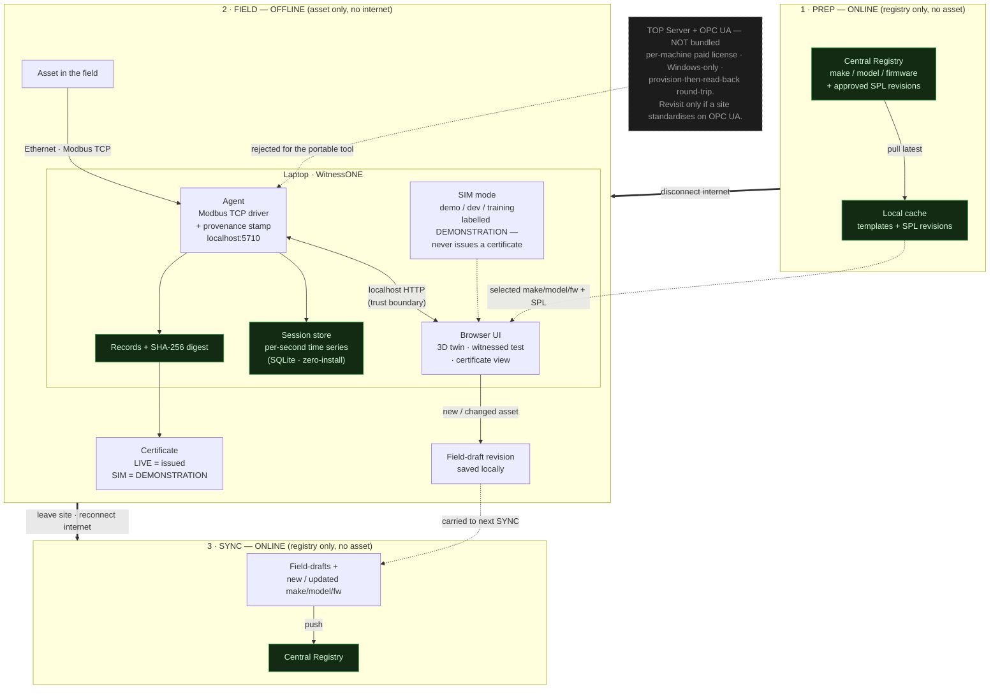

# WitnessONE — Architecture (corrected, post-v0.8.3)

This replaces the earlier single-flow diagram. The key correction: **online and
field are two phases that never overlap** (air-gapped field network, single NIC —
enforced in software), so "online" is a *phase*, not a mid-flow "Online?" branch.
Decisions behind every box: `docs/ARCHITECTURE_DECISIONS.md`.

## How to read it

- **Three phases, never simultaneous.** The heavy `==>` arrows are the only way
  to move between phases, and each one names the network transition
  (disconnect / reconnect). The software enforces that a registry connection and
  a device connection are never open at the same time.
- **The trust boundary is the localhost HTTP hop** between the Browser UI and the
  Agent. Browsers can't open raw sockets, so *all* device I/O is in the Agent;
  the UI is presentation. This is where the security model lives (localhost bind,
  CORS lockdown, `file://` null-origin allowance, DNS-rebinding Host check).
- **Data in vs. record out.** Values flow `asset → Agent → UI`; the product that
  comes *out* is the certificate plus the local session store (trends / replay)
  and the digested record — the boxes the old diagram omitted.
- **SIM is a side input to the UI**, clearly labelled, and can never reach the
  "issued certificate" path — only `rec` (a real live record) feeds an issued
  certificate.
- **TOP Server / OPC UA is drawn as rejected**, not as a live path, per AD-3.

## Open item shown implicitly

The digest today is computed over a UI-assembled payload (see the trust-boundary
note and the P4 open decision in `docs/ARCHITECTURE_DECISIONS.md`). The strong
form is the Agent stamping each value it reads server-side; the diagram already
places the "provenance stamp" in the Agent to reflect that target.
